# Neumorphic

[](https://swiftpackageindex.com/gewill/neumorphic) [](https://swiftpackageindex.com/gewill/neumorphic) [](https://github.com/gewill/neumorphic/actions/workflows/ci.yml) [](https://github.com/gewill/neumorphic/blob/master/LICENSE)

A SwiftUI library for soft, tactile "neumorphism" interfaces — the two shadow modifiers the style depends on, plus a set of accessible controls built on top of them.

SwiftUI gives you an outer shadow in one line. It has no inner shadow, and neumorphism needs both. This package supplies the missing half, then uses it consistently across buttons, toggles, sliders, fields, and the rest so a whole screen can share one soft surface.

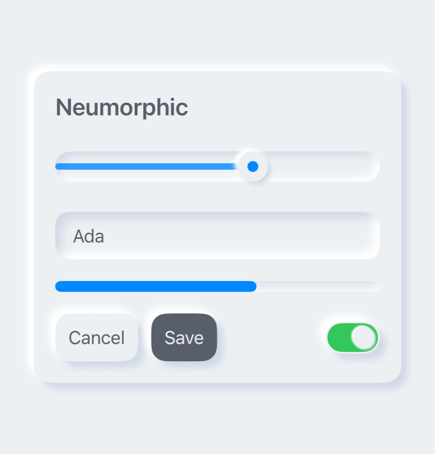

Browse the [complete control gallery](https://swiftpackageindex.com/gewill/neumorphic/master/documentation/neumorphic/controlgallery) for visual previews and API links.

## About this fork

This is a fork of [costachung/neumorphic](https://github.com/costachung/neumorphic) by Costa Chung, who designed the original shadow modifiers and button styles. Upstream's last commit was October 2024, at `v2.0.7`; everything from `v2.1.0` onward lives here.

What this fork has added since that point:

- **A real control set.** Slider, TextField, Stepper, DatePicker, Picker, Checkbox, Radio, Menu, ProgressView (linear and circular), DisclosureGroup, Link, and a card modifier — so you aren't hand-rolling every widget out of raw shadows.
- **Accessibility as a baseline, not an afterthought.** VoiceOver labels, values and adjustable actions, configurable button bounds, non-color selection cues, Dynamic Type layouts, Reduce Motion handling, and macOS keyboard focus.
- **Environment themes.** `.neumorphicTheme(_:)` with a built-in high-contrast preset, plus shadow presets to trade visual depth against rendering cost.
- **Modern toolchain.** Swift 6 strict-concurrency clean, a DocC catalog, Swift Package Index integration, and CI that checks formatting, both deployment-target floors, DocC, and API compatibility against the previous release tag.

I maintain this for my own projects and plan to keep it current. Issues and pull requests are welcome — just treat it as a small single-maintainer package rather than a large community effort. Upstream remains the original work and its license carries through unchanged.

## Requirements

| | |
|---|---|
| Swift | 5.7+ (Xcode 14+) |
| iOS | 13.0+ |
| macOS | 10.15+ |

`NeumorphicMenu` and `NeumorphicLink` need iOS 14+ / macOS 11+. Everything else works on the base deployment targets.

Staying on Xcode 13 or earlier? Pin to the `2.1.x` line — `2.2.0` raised the Swift tools version to 5.7.

## Installation

### Xcode

File → Add Package Dependencies, paste `https://github.com/gewill/neumorphic.git`, and pick a version rule.

### Package.swift

```swift
.package(url: "https://github.com/gewill/neumorphic.git", from: "2.4.1")
```

Then import it:

```swift
import Neumorphic
```

## The two shadows

Everything else in this library is built out of these.

### Outer shadow

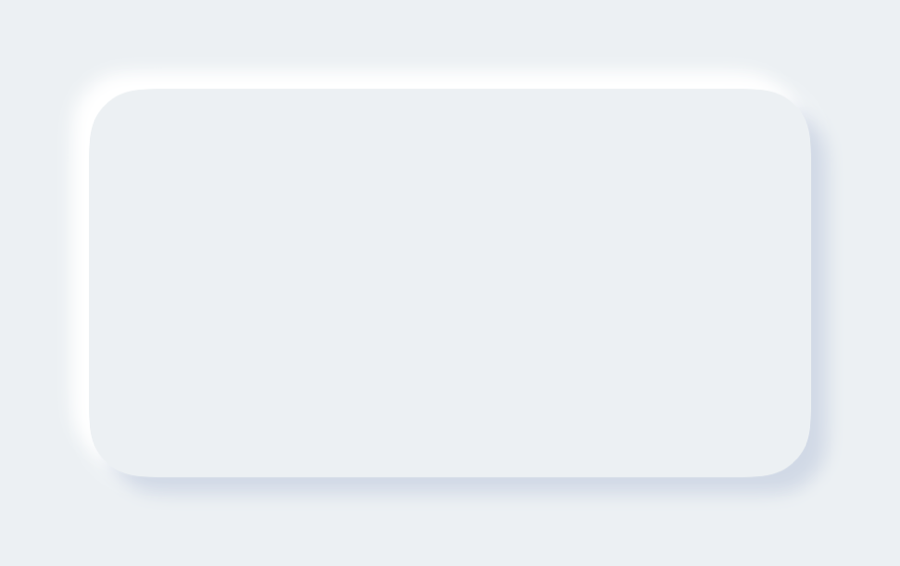

```swift
RoundedRectangle(cornerRadius: 20)
    .fill(Color.Neumorphic.main)
    .softOuterShadow()
```

### Inner shadow

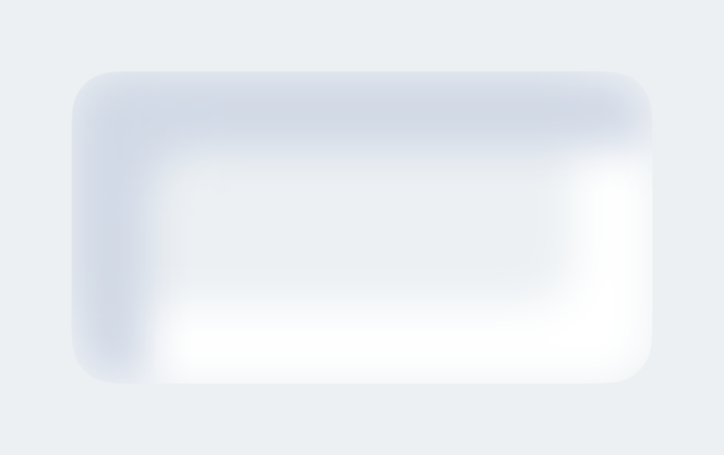

```swift
RoundedRectangle(cornerRadius: 20)
    .fill(Color.Neumorphic.main)
    .softInnerShadow(RoundedRectangle(cornerRadius: 20))
```

Note that `softInnerShadow` takes the shape as an argument — it needs to know what to clip against, which is exactly the thing SwiftUI's built-in shadow can't do.

### Both, side by side

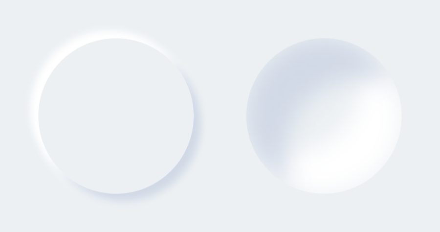

```swift
HStack {
    Circle().fill(Color.Neumorphic.main).softOuterShadow()
    Circle().fill(Color.Neumorphic.main).softInnerShadow(Circle())
}
```

### Tuning them

```swift
func softOuterShadow(
    darkShadow: Color = Color.Neumorphic.darkShadow,
    lightShadow: Color = Color.Neumorphic.lightShadow,
    offset: CGFloat = 6,
    radius: CGFloat = 3
) -> some View

func softInnerShadow<S: Shape>(
    _ content: S,
    darkShadow: Color = Color.Neumorphic.darkShadow,
    lightShadow: Color = Color.Neumorphic.lightShadow,
    spread: CGFloat = 0.5,
    radius: CGFloat = 10
) -> some View
```

Or reach for a preset instead of tuning by hand — `.standard`, `.subtle`, or `.none`:

```swift
RoundedRectangle(cornerRadius: 16)
    .fill(Color.Neumorphic.main)
    .softOuterShadow(.subtle)
```

An inset field, for instance, is just a text field over an inner-shadowed background:

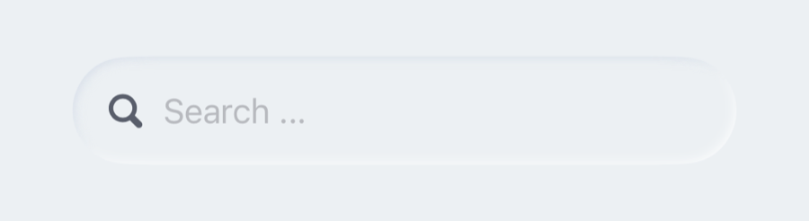

```swift
HStack {
    Image(systemName: "magnifyingglass")
        .foregroundColor(Color.Neumorphic.secondary)
        .font(Font.body.weight(.bold))
    TextField("Search ...", text: $name)
        .foregroundColor(Color.Neumorphic.secondary)
}
.padding()
.background(
    RoundedRectangle(cornerRadius: 30)
        .fill(Color.Neumorphic.main)
        .softInnerShadow(RoundedRectangle(cornerRadius: 30), spread: 0.05, radius: 2)
)
```

And a bar chart is an inner-shadowed track with a plain fill on top:

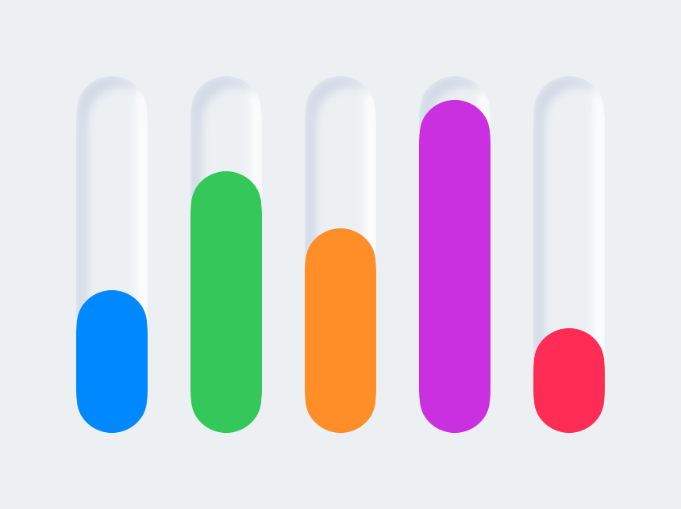

```swift
ZStack(alignment: .bottom) {
    RoundedRectangle(cornerRadius: 20)
        .fill(Color.Neumorphic.main)
        .softInnerShadow(RoundedRectangle(cornerRadius: 20), spread: 0.3, radius: 2)
        .frame(width: 30, height: 150)

    RoundedRectangle(cornerRadius: 20)
        .fill(barColor)
        .frame(width: 30, height: 100)
}
```

## Controls

Rather than rebuilding these on top of the shadow modifiers each time, the package ships them:

| Category | Controls |
|---|---|
| Input | `NeumorphicSlider`, `NeumorphicTextField`, `NeumorphicStepper`, `NeumorphicDatePicker` |
| Selection | `NeumorphicPicker`, `NeumorphicCheckbox`, `NeumorphicRadio`, `NeumorphicMenu` |
| Status | `NeumorphicProgressView`, `NeumorphicCircularProgressView` |
| Layout | `NeumorphicDisclosureGroup`, `.neumorphicCard()` |
| Navigation | `NeumorphicLink` |

```swift
VStack(spacing: 20) {
    NeumorphicSlider(value: $volume, in: 0...100, step: 1)
    NeumorphicTextField("Name", text: $name)
    NeumorphicProgressView(value: progress)
    NeumorphicPicker(selection: $mode, options: ["Light", "Dark"])
}
```

macOS gets two extras: `.neumorphicFocusRing(_:isFocused:)` for keyboard focus and `.neumorphicHover(_:isHovered:)` for pointer feedback.

## Control sizing

Open **Sizing → Controls** in the example app to select a control, switch size classes, compare
native SwiftUI with Neumorphic, and toggle layout outlines, long labels or disabled states.

| macOS · Regular | iOS · Regular |
| --- | --- |
| 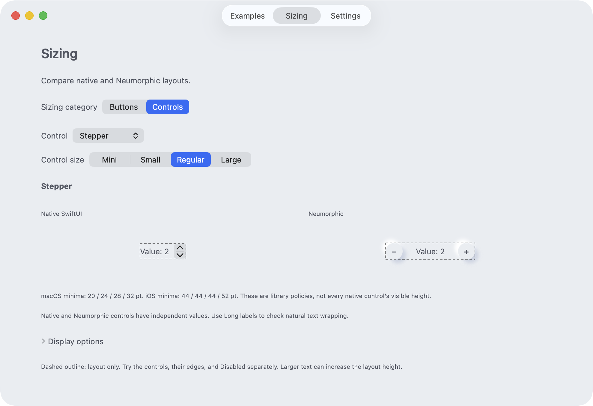 | 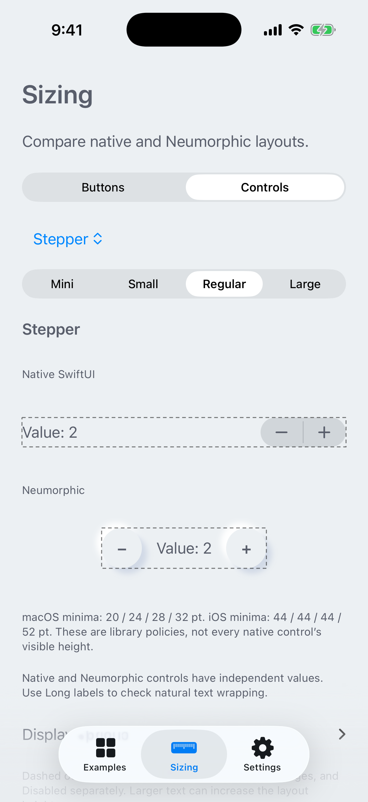 |

Text fields, sliders, switches, steppers, segmented pickers, menus, checkboxes, radio buttons, and disclosure headers use platform-aware sizing. Regular controls reserve a minimum interaction height of **28 pt on macOS** and **44 pt on iOS**. Content and padding are included once; longer or larger text can grow naturally.

On macOS and iOS 15+, `controlSize` (`.mini`, `.small`, `.regular`, or `.large`) also adjusts custom surfaces and spacing. macOS minimum dimensions are 20/24/28/32 pt; iOS uses 44/44/44/52 pt. Earlier iOS versions use regular metrics. Extra-large currently uses large metrics. Native DatePicker geometry is preserved with platform-specific decoration padding.

Omit Switch `height` to follow the platform and size environment; provide it explicitly to retain a chosen visual height. Transparent margins participate in toggle hit testing, and the whole text-field surface can receive focus while preserving native editing.

**Breaking layout change for the next major release:** Compact Mac controls become smaller, Stepper/Picker/Menu no longer add style padding around an already minimum-sized label, and the original switch style adopts the same sizing as the current style. See [Control sizing](Sources/Neumorphic/Neumorphic.docc/Articles/ControlSizing.md) for geometry and migration details.

## Buttons

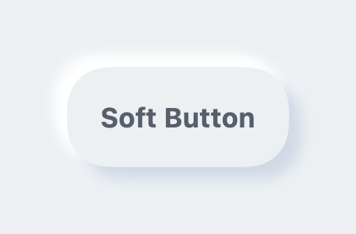

```swift
Button(action: {}) {
    Text("Soft Button").fontWeight(.bold)
}
.neumorphicThemedButtonStyle(RoundedRectangle(cornerRadius: 20))
```

```swift
func neumorphicThemedButtonStyle<S: Shape>(
    _ shape: S,
    padding: CGFloat = 16,
    pressedEffect: SoftButtonPressedEffect = .hard
) -> some View

func neumorphicThemedButtonStyle<S: Shape>(
    _ shape: S,
    role: NeumorphicButtonRole,
    padding: CGFloat = 16,
    pressedEffect: SoftButtonPressedEffect = .hard
) -> some View
```

Any shape works, and `SoftDynamicButtonStyle` is there for buttons that need colors outside the current theme:

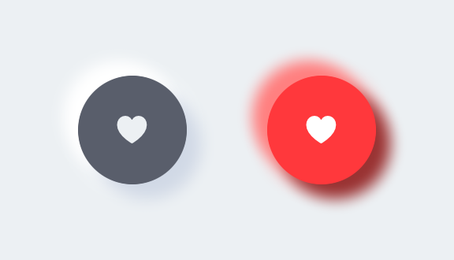

```swift
HStack {
    Button(action: {}) {
        Image(systemName: "heart.fill")
    }
    .neumorphicThemedButtonStyle(Circle(), role: .accent)

    Button(action: {}) {
        Image(systemName: "heart.fill")
    }
    .buttonStyle(
        SoftDynamicButtonStyle(
            Circle(),
            mainColor: .red,
            textColor: .white,
            darkShadowColor: Color(red: 0.6, green: 0.2, blue: 0.2),
            lightShadowColor: Color(red: 1.0, green: 0.5, blue: 0.5),
            pressedEffect: .hard
        )
    )
}
```

Open **Sizing → Buttons** in the example app for platform minimums, expanded targets, label padding
and growing text. Dynamic button styles use explicit `size`, `padding` and `minimumSize`; they do
not use the Controls size selector.

| macOS · Platform minimum | iOS · Platform minimum |
| --- | --- |
| 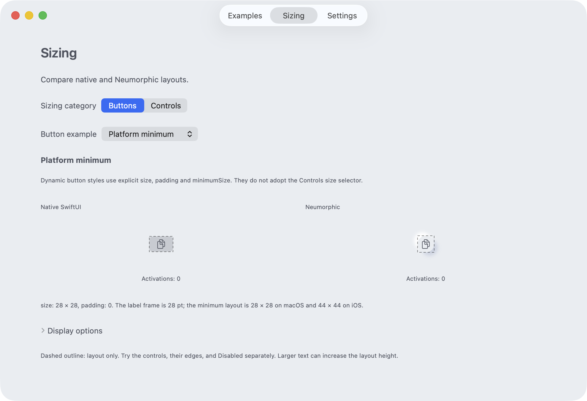 | 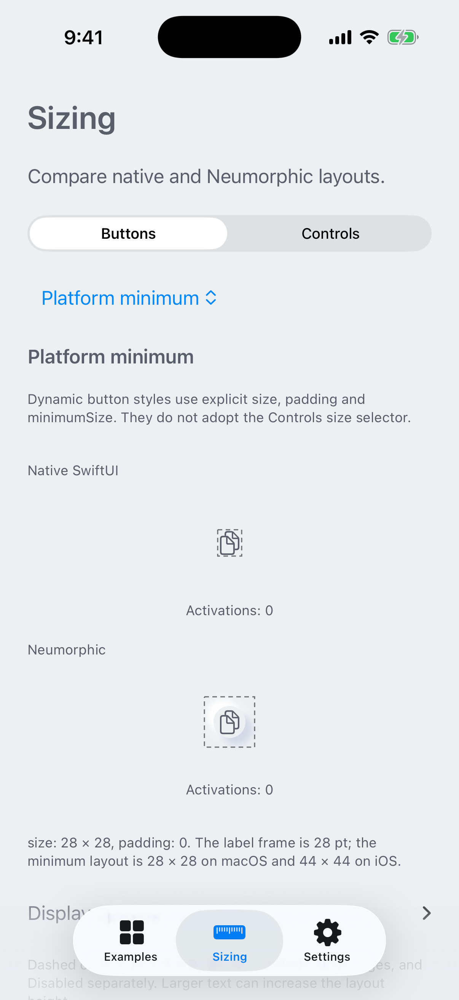 |

[Regenerate the sizing screenshots](Scripts/readme-shots/README.md#sizing-page-real-macos-and-ios-controls)
from the running example app.

Dynamic button styles use a **28×28-point minimum on macOS and 44×44 on iOS**, including the themed modifiers. The complete layout rectangle is hittable, including transparent margins:

```swift
Button {} label: { Image(systemName: "doc.on.doc") }
    .fixedSizeSoftButtonStyle(
        Circle(), size: CGSize(width: 28, height: 28)
    )
    .accessibilityLabel("Copy")
```

Apple's [Accessibility guidelines](https://developer.apple.com/design/human-interface-guidelines/accessibility) list macOS default controls at 28×28 pt (minimum 20×20), and iOS/iPadOS at 44×44 pt (minimum 28×28). The default minimum follows the platform. Override it with `minimumSize`; `.zero` removes it. Negative or nonfinite minimum components become zero.

`size` is the fixed **label frame before padding**. The convenience modifier adds no padding; the style initializer defaults to 16 pt per edge. The surface covers the padded label, then `minimumSize` adds transparent space as needed. With all dynamic style overloads, the entire final rectangle is hittable and stays stable during presses. Outer shadows can extend beyond it and reserve no layout space.

For growing or multiline text, use `.softButtonStyle(Capsule(), padding: 6)`. See [Button sizing](Sources/Neumorphic/Neumorphic.docc/Articles/ButtonSizing.md) for the full sizing contract.

**Breaking layout change for the next major release:** The previous macOS minimum was 44×44 pt. Existing calls now use 28×28 pt, so compact buttons can occupy less space. Pass `minimumSize: CGSize(width: 44, height: 44)` to keep the previous minimum. Larger content and explicit `size` values still determine the final layout.

### Pressed effects

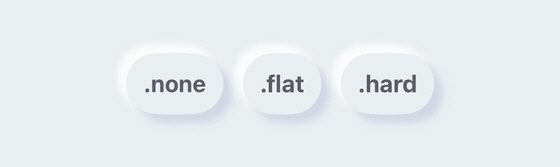

```swift
HStack {
    Button(action: {}) { Text(".none").fontWeight(.bold) }
        .neumorphicThemedButtonStyle(Capsule(), pressedEffect: .none)
    Button(action: {}) { Text(".flat").fontWeight(.bold) }
        .neumorphicThemedButtonStyle(Capsule(), pressedEffect: .flat)
    Button(action: {}) { Text(".hard").fontWeight(.bold) }
        .neumorphicThemedButtonStyle(Capsule(), pressedEffect: .hard)
}
```

`.hard` presses the surface in, `.flat` removes the shadow, `.none` leaves it alone.

## Toggles

### Switch

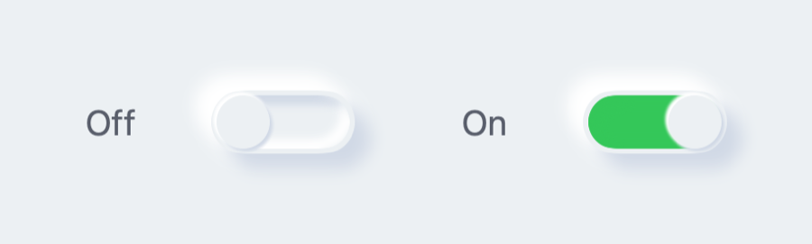

```swift
Toggle("Toggle", isOn: $toggleIsOn)
    .toggleStyle(.neumorphicSwitch)
```

Or `.neumorphicThemedSwitchStyle(tint:labelsHidden:height:)` to follow the environment theme, and `NeumorphicSwitchToggleStyle(tint:labelsHidden:)` when you want to configure it directly.

### Shape

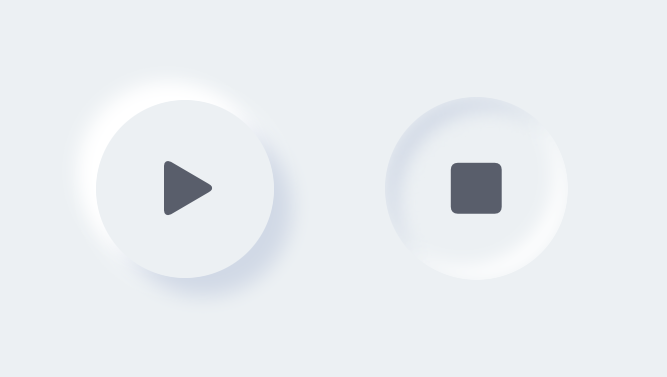

A toggle that presses in and stays in — good for play/stop:

```swift
Toggle(isOn: $toggleIsOn) {
    Image(systemName: toggleIsOn ? "stop.fill" : "play.fill")
        .font(.title)
}
.neumorphicThemedToggleStyle(Circle(), padding: 20)
```

## Themes, light and dark

`Color.Neumorphic` adapts to light and dark mode on its own. For anything beyond that, put a theme in the environment — built-in controls read it, and the themed button and toggle modifiers follow it. Buttons use `.surface` by default; use `.accent` for the theme's accent/onAccent pair:

```swift
VStack {
    NeumorphicTextField("Name", text: $name)
    Button("Save") { }
        .neumorphicThemedButtonStyle(RoundedRectangle(cornerRadius: 12), role: .accent)
}
.neumorphicTheme(.highContrast)
```

`.standard` and `.highContrast` ship with the package; `NeumorphicTheme` is a plain struct, so your own palette is just another value. The four-color initializer remains available and maps accent/onAccent to secondary/main for source-compatible behavior; use the six-color initializer when those semantic pairs differ.

`NeumorphicKit.colorSchemeType` still exists for source compatibility with apps that override color resolution globally. New code should prefer `preferredColorScheme(_:)` and `.neumorphicTheme(_:)`.

## Accessibility

Neumorphism is a low-contrast style, which makes accessibility work load-bearing rather than optional. Across the full supported deployment range, the controls here provide VoiceOver labels, values, traits, and adjustable actions; provide rectangular button hit bounds with platform defaults and a `minimumSize` override; signal selection with symbols and not color alone; and respect Reduce Motion in anything animated.

Two things worth doing on your side: pass `accessibilityLabel` to sliders and progress views so VoiceOver announces something more useful than "Slider", and test with VoiceOver, Larger Text, Increase Contrast, Reduce Motion, and a hardware keyboard on macOS.

The design reasoning behind these choices is written up in [Docs](Docs).

## Example project

Open **neumorphic-examples** to browse every control on iOS and macOS, including theme and accessibility previews.

## Contributing

See [CONTRIBUTING.md](CONTRIBUTING.md) for the checks CI runs — formatting, tests, both deployment-target builds, and a Swift 6 strict-concurrency typecheck. Running them before opening a pull request saves a round trip.

## Credits

Original library by [Costa Chung](https://github.com/costachung) ([@costachung](https://twitter.com/costachung)). Maintained here by [gewill](https://github.com/gewill) since `v2.1.0`.

## License

MIT, unchanged from upstream. See [LICENSE](LICENSE).
